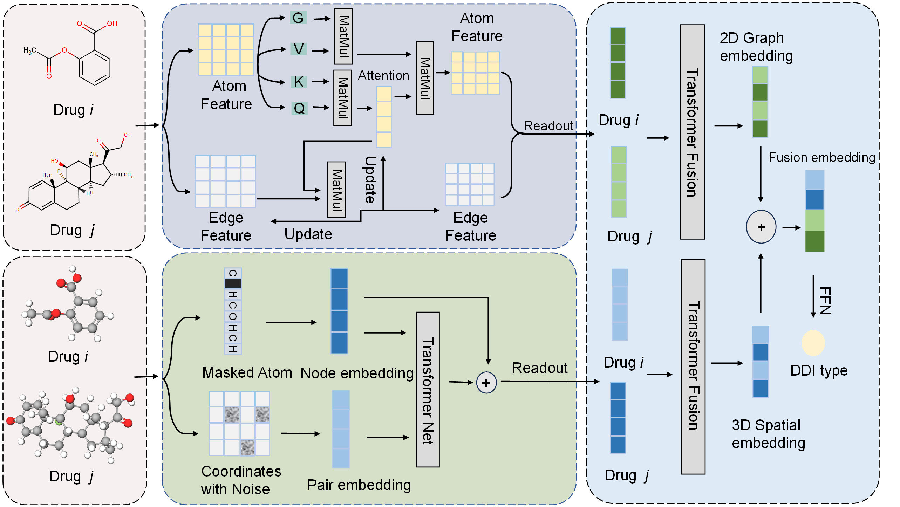

# SGT-DDI: A multimodal information integration Framework for Robust Prediction of Drug-Drug Interactions

Accurate prediction of drug-drug interactions (DDIs) is critical for enhancing therapeutic safety and efficacy. However, current computational approaches predominantly rely on single-modality representations of drug structures, neglecting complementary information across distinct structural hierarchies. This oversight compromises predictive generalizability for novel compounds. To address this limitation, we propose SGT-DDI, a multimodal learning framework that synergistically integrates three-dimensional (3D) geometric and two-dimensional (2D) molecular substructure features through a hierarchical Transformer architecture. Our model employs a spatial geometry encoder to capture atomic-level 3D conformational properties and a graph transformer network to extract 2D topological patterns. These cross-modal representations are unified via multi-head attention mechanisms to generate context-aware drug embeddings, enabling simultaneous prediction of interaction occurrence and specific pharmacological effects. After evaluation on the DrugBank dataset, SGT-DDI achieves the best performance with an accuracy of 97.23% (S1) in the task of seen drugs, 72.81% (S2) and 52.65% (S3) in tasks of unseen drugs, indicating excellent generalization to them. Ablation studies validate the necessity of both structural encoding modules and cross-modal fusion mechanisms. Case analyses further reveal interpretable attention patterns that highlight critical interaction-determining substructures, corroborating the model's reliability for predicting interactions involving unknown drugs.
## Framework

## File list
~~~
- data
- code
 - compute.py: The Folder contains the trained model of DMFF-DTA.
 - load.py: The code for data preprocessing.
 - model.py: The code about model.
 - transductive.py: The code about transductive setting.
 - inductive.py: The code about inductive setting.
~~~
## Dataset

Before training, you can unzip data.tar.gz to obtain the data required for training.

## Run Code

### Step 1: unzip data.tar.gz
~~~
tar -zxvf data.tar.gz
~~~

### Step 2: run transductive.py/inductive.py
~~~
python transductive.py
~~~
### Step 3: Switch to your data
First, add your data under `Data` and obtain `data.npz` according to `process.py`
Then you need to modify the following contents in the `dataset.py`
~~~
with np.load('../data/data.npz') as data:
   
    drug_ids = data['drug']
    unimols = data['unimol']

df_drugs_smiles = pd.read_csv('../data/drugbank/drug_smiles.csv')
~~~

## Requirements

- networkx==3.1
- numpy==1.24.3
- pandas==1.5.3
- rdkit==2022.03.2
- scikit_learn==1.3.0
- scipy==1.10.1
- torch==1.12.1
- torch_geometric==2.3.1
- tqdm==4.65.0

## Citation

Coming Soon
